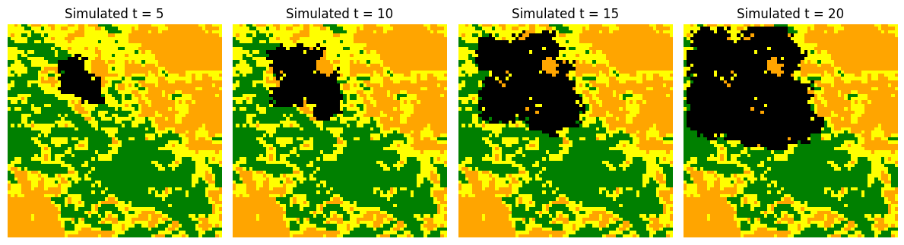
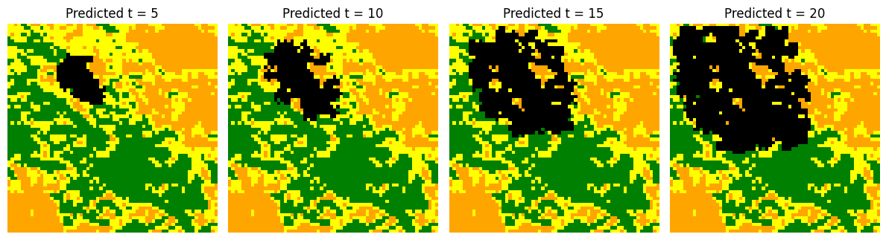
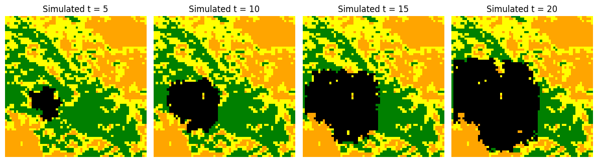
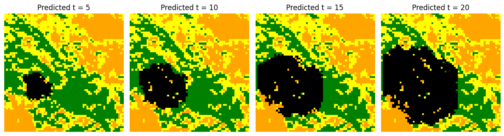
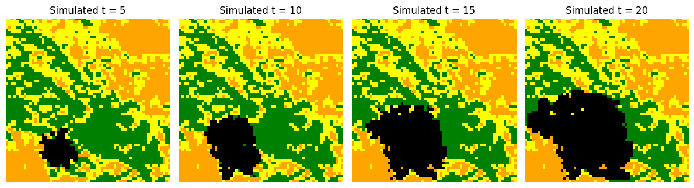
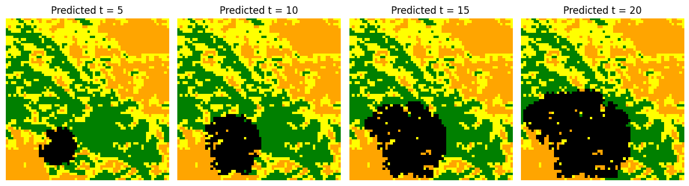
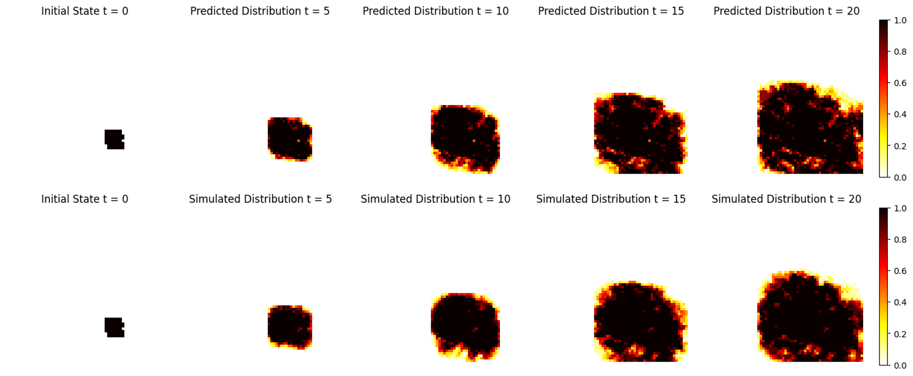
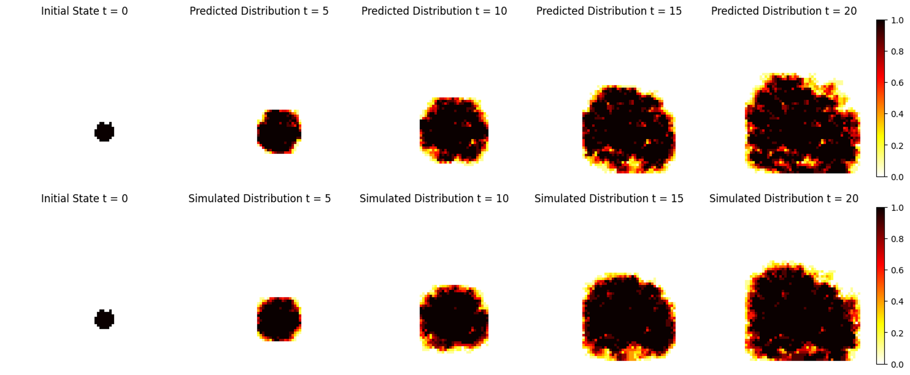
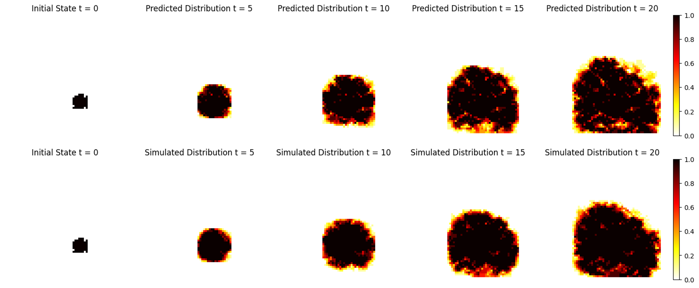

# MSc Project

**Using Diffusion Models to Generate Scenarios of Wildfire Spread**

## Overview
Real-time wildfire spread forecasting is crucial for ensuring public safety to enable timely evacuations and effective deployment of firefighting resources with the recent increase in wildfires. It facilitates protection of critical infrastructure and sensitive ecosystems. Physics based simulation models such as cellular automata and machine learning alternatives such as three dimensional vector quantized variational autoencoders have been used in the task of predicting wildfire spread patterns. However, the simulation based methods pose the drawback of requiring substantial quantities of region-specific data to train, leading to a significant computational bottleneck. Machine learning models on the other hand, despite being easy to train, are deterministic in nature as they encode input data into discrete latent spaces with fixed mappings. A deterministic model fails to capture the inherent randomness and variability involved in the non-linear and complex interactions between different factors that influence wildfires as their fixed latent space is not nuanced enough to characterize the dynamic effect of these interactions. In this paper, a generative alternative is proposed using an image-conditioned guided Diffusion model. The model has been trained using sequences of CA simulated wildfire spread data based on the recent Chimney Fire event in California. The diffusion model was shown to successfully generate coherent spatio-temporal sequences of wildfire progression with similarity to ground truth simulated data  ranging from a peak SSIM of $0.94$ decreasing to $0.67$ and RMSE over burned area ranging from $0.10$ to $0.25$ over 30 hours intervals upto 120 hours. This was shown to outperform a deterministic Autoencoder baseline modelwith SSIM ranging from $0.9$ to $0.65$ and an RMSE over burned area of $0.12$ to $0.30$ at the same time intervals. The diffusion model also illustrated improving precision and F1-Score over long-range predictions relative to the deterministic baseline indicating high fidelity in generated one-shot fire spread predictions. We further leveraged the stochastic nature of diffusion models to predict multiple fire spread scenarios from the same starting state to capture the expected fire susceptibility likelihood of the region at that time. The generated burn probability maps coincided with the CA simulated data with a temporal distribution of KL Divergence ranging from $0.035$ to $0.04$ and a Wasserstein Distance of $0.04$ and $0.1$ over 120 hours.  

By leveraging the strengths of diffusion models, we aim to overcome the limitations of current deterministic wildfire forecasting models, thus providing a more robust tool for timely decision-making during fire emergencies. In summary, the main contributions of this paper are as follows:
* Seek to enhance the accuracy and efficiency of wildfire propagation predictions through the novel application of diffusion models, ultimately contributing to improved environmental safety and resource management.
* Stochastic predictions of diffusion models provide an advantage over existing deterministic models to account for the inherently variable nature of wildfire dynamics, allowing for the generation of fire susceptibility maps showing the expected likelihood of fire spread. 
* An implemented CA model is used to generate image sequences of fire propagation based on the geophyiscal dynamics of the Chimney Fire event to train and evaluate the diffusion model.


## Project Structure
```plaintext
src
├── data_processing/  
│   ├── convert2mpy.py                    # converts raw mp4 to mpy       
|   ├── util.py                           # helper functions
├── model/                    
│   ├── baselines                         # Notebooks with baseline models for evaluation
│   |   ├── baseline_cnn.ipynb            # final deterministic baseline
│   |   ├── baseline_cnn.py               # deterministic baseline as a module
│   |   ├── baseline_convlstm.ipynb       # test with convlstm baseline
│   |   ├── baseline_seq_convlstm.ipynb   # test sequential predictions with convlstm baseline

│   ├── ddpm                              # code for diffusion model  
│   |   ├── blocks.py                     # component blocks of ddpm
│   |   ├── dataset.py                    # dataset to handle paired data for training and sampling
│   |   ├── diffusion_proc.py             # Gaussian diffusion handler used for sampling and training
│   |   ├── gde_image_conditioned.ipynb   # notebook performing training and sampling of ddpm model
│   |   ├── sampling.py                   # script to sample images with trained ddpm 
│   |   ├── training_script.py            # script to train ddpm 
│   |   ├── unet.py                       # Unet architecture for ddpm
│   ├── __init__.py                       # makes directory to module
│   ├── wildfire_ddpm.pt                  # trained model weights
├── evaluation/                           # notebooks used to test and evaluate ddpm
│   ├── diffusion_distribution.ipynb      # test stochastic outputs of ddpm in predicting wildfires
│   ├── evaluate_model.ipynb              # Compare baseline model to ddpm
│   ├── sequential_distribution.ipynb     # generate sequential fire susceptibility maps autoregressively using ddpm
│   ├── sequential_predictions.ipynb      # generate sequential fire progression predictions autoregressively using ddpm
requirements.txt        # Dependencies
README.md               # Project documentation
```


## Model
We have implemented a conditional denoising diffusion probablistic model (DDPM) that utilizes classifier-free guidance to predict the spatial geometry of wildfire spread given an initial state of the fire as input. The model generates a predicted view of the fire 30 hours in the future, constrained upon the initial fire state.

The DDPM is implemented using a U-Net architecture as the backbone for the denoising (reverse diffusion) process. The model learns the geophsyical parameters influencing wildfire propagation from Cellular Automata simulated sequences of fire progression localized in the Chimney Fire ecoregion of Southern California. Shown below is a sample of the simulated data sequence utilized in training the DDPM. 


The model is trained on data pairs, with a target image of fire at time t + 30hrs and a conditional image of the fire at time t. The DDPM iteratively adds noise to the target image during forward diffusion. Features extracted from the conditional image is then concatenated along the channel dimension to the noisy target. They are collectively denoised during the reverse diffusion process to learn the distribution of noise added conditioned on the initial fire state. 

The model output diversity is constrained by the classifier-free guidance conditioning strategy. It randomly drops the conditoning input during training based on a pre-defnied probability ($p_{uncond}$ = 0.2) to learn how to generate outputs in both conditional and unconditional settings. This reduces the randomness of generated images such that fire dynamics shown in output images remain temporally consistent with the conditional image provided as input. 

During sampling with the trained DDPM, the model takes the initial fire state image as input and performs iterative denoising of a random noise sample. Below is a view of the denoising process in action showing the iterative refinement of pure noise samples over 500 steps to generate the final output.


## Results
### Predicting wildfire progression 

We have utilzied the trained DDPM to predicted sequences of wildfire progression over long horizons, upto 120 hours from the initial point of ignition. The model is provided the first image of the initial fire state, and it auto-regressively generates future fire spread patterns at 30 hours intervals. We have shown samples of the ground truth (CA simulated) fire progression sequence along with the DDPM predicted sequence below. 











### Predicting likelihood of fire susceptibility

We have further applied out trained DDPM model to leverage the stochastic generative process to produce the spatial distribution of the probability of burning. This captures the fire susceptibility of the region under the given ignition conditions. This was generated by performing multiple sampling iterations from the same starting state and computing the mean prediction at each time interval. This was then compared against the average CA simulated fire susceptibility maps to validate the fidelity of our model's predictions. A few samples of our model's fire susceptibility predictions are shown below against the ground truth (CA simulated) data. 



